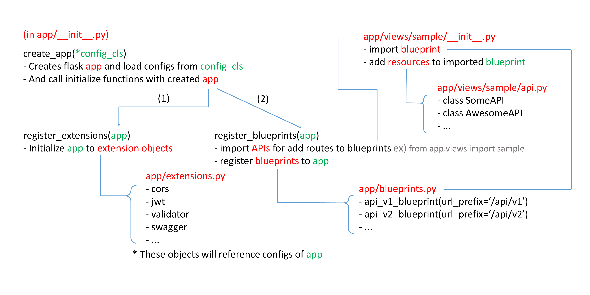

# Flask-Large-Application-Example
This is how I structure my large Flask applications.

## About
Flask는 마이크로 웹 프레임워크입니다. Django처럼 정해져 있는 구조가 없어 항상 개발자에게 구조에 대한 고민을 하게 만듭니다. 이 저장소는 제가 Flask를 배우기 시작했던 때부터, 1년 가까이의 시간동안 Flask 어플리케이션의 구조에 대해 고민한 흔적입니다.

## Abstract

## I Referred
### People
<a href="https://github.com/JungWinter">정겨울님</a>

### Repository
<a href="https://github.com/yoshiya0503/Flask-Best-Practices">Flask Best Practice에 관한 일본어 Repository</a>  
<a href="https://github.com/miguelgrinberg/flasky">flasky - O'Reilly의 'Flask Web Development' 예제 코드 모음</a>  
<a href="https://github.com/JackStouffer/Flask-Foundation">JackStouffer / Flask-Foundation</a>  
<a href="https://github.com/realpython/flask-skeleton">realpython / flask-skeleton</a>  
<a href="https://github.com/swaroopch/flask-boilerplate">swaroopch / flask-boilerplate</a>

### Website
<a href="https://exploreflask.com/en/latest/">Explore Flask - Explore Flask 1.0 documentation</a>  
<a href="http://exploreflask.com/en/latest/organizing.html">Organizing your project - Explore Flask 1.0 documentation</a>  
<a href="http://flask.pocoo.org/docs/0.12/patterns/">Patterns of Flask - Flask Documentation (0.12)</a>  
<a href="http://flask.pocoo.org/docs/0.12/patterns/packages/">Larger Applications - Flask Documentation (0.12)</a>  
<a href="http://flask.pocoo.org/snippets/category/application-structure/">Application Structure | Flask(A Python Microframework)</a>  

<a href="https://www.digitalocean.com/community/tutorials/how-to-structure-large-flask-applications">How To Structure Large Flask Applications | DigitalOcean</a>  
<a href="https://damyanon.net/post/flask-series-structure/">How to Structure a Flask Application</a>  
<a href="https://www.gitbook.com/book/ecod/flask-large-app-how-to/details">Flask Large App How to - GitBook</a>  
<a href="https://libsora.so/posts/flask-project-structure/">Flask Project 구조 예제 - /usr/lib/libsora.so</a>  
<a href="https://stackoverflow.com/questions/14415500/common-folder-file-structure-in-flask-app">StackOverflow - Common folder/file structure in Flask app</a>

### Presentation
<a href="http://slides.skien.cc/flask-hacks-and-best-practices/">Flask Hacks and Best Practices</a>
